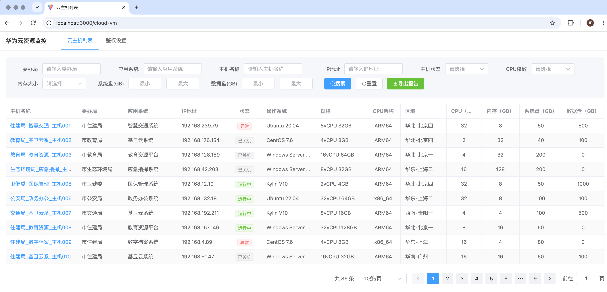
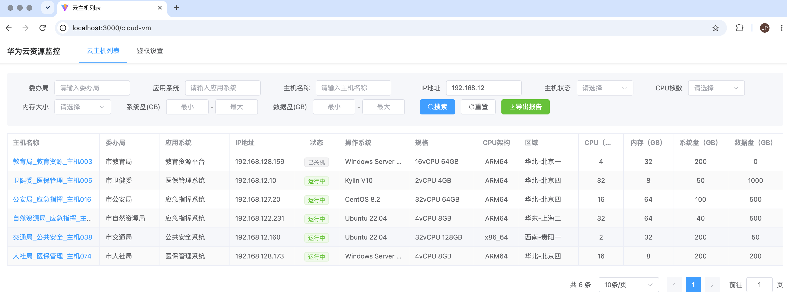
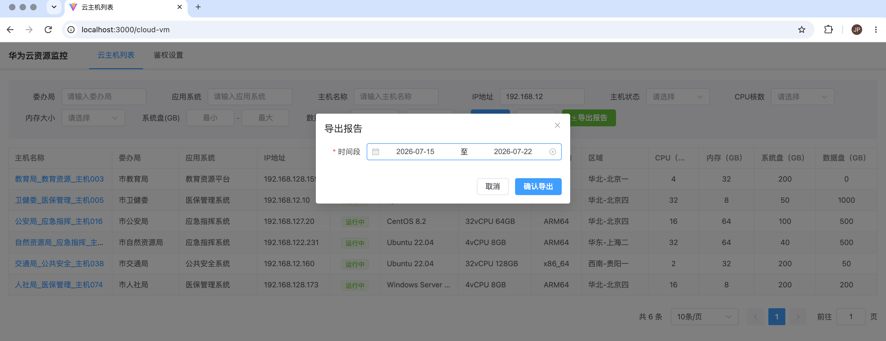
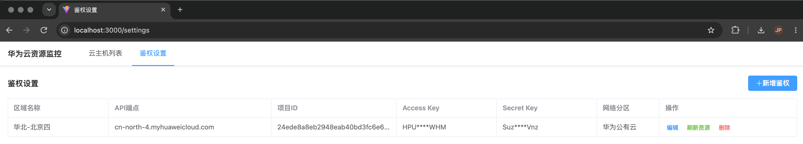

# cloudoperation-resource-monitor-dashboard

> 华为云资源监控仪表盘 — 弹性云服务器、云硬盘与监控指标数据采集、展示与导出平台


[]()
[]()


---

## 方案简介

HuaweiCloud Resource Monitor Dashboard 是一个面向**华为云弹性云服务器（ECS）、云硬盘（EVS）和云监控（CES）**的资源监控仪表盘。用户通过前端页面配置租户 AKSK 等鉴权信息后，后端定时或手动从华为云 API 采集资源数据与使用率指标，保存到本地 SQLite 数据库，并通过 RESTful API 为前端提供查询、筛选和导出报告功能。

### 解决的核心问题

在多项目、多区域的华为云环境中，运维团队通常面临以下挑战：

- **资源盘点困难**：云主机分散在不同区域和项目下，缺乏统一视图
- **使用率不透明**：CPU、内存、磁盘使用率数据分散在云监控服务中，难以批量获取和对比
- **报告生成繁琐**：定期巡检需要手动导出多份数据拼凑报告，效率低下
- **资源归属不清**：云主机命名规则与部门/应用系统的对应关系需要人工维护

本平台通过**定时数据采集 + 多维度筛选 + 一键导出报告**的方式，帮助运维团队高效完成资源巡检和报表输出。

---

## 功能特性

- **鉴权配置管理**：通过前端设置页面管理多租户鉴权信息（AKSK），支持新增、编辑、删除，每个租户可单独触发资源刷新
- **ECS 云主机数据采集**：自动从华为云 ECS API 分页获取所有弹性云服务器信息，包括规格、操作系统、IP 地址等
- **EVS 云硬盘数据采集**：自动获取云硬盘信息，关联到对应云主机，区分系统盘/数据盘及磁盘类型（高IO/超高IO）
- **CES 监控指标采集**：批量获取 CPU 使用率、内存使用率、磁盘使用率等监控数据，支持系统指标（SYS.ECS）和 Agent 指标（AGT.ECS）双源采集
- **定时自动采集**：通过系统设置页面配置定时任务执行时间和监控数据粒度，默认每天凌晨 2 点执行，数据粒度默认 5 分钟
- **解析规则配置**：配置云主机名称解析规则，从命名规则中自动提取委办局和应用系统信息
- **多条件筛选查询**：支持按委办局、应用系统、主机名称、IP 地址、主机状态、CPU 核数、内存大小、系统盘/数据盘范围等条件筛选
- **主机详情页**：点击云主机可跳转至详情页，展示主机基本信息、磁盘信息和使用率监控图表，支持时间范围和数据粒度切换
- **单主机监控数据导出**：在主机详情页可单独导出该主机的使用率数据为 Excel 文件
- **Excel 报告导出**：选择日期范围后一键导出包含资源信息和监控使用率的 Excel 报告
- **Mock 数据自动兜底**：当后端 API 无数据或请求失败时，前端自动使用 Mock 数据展示，确保页面可用
- **CPU 架构自动识别**：根据云主机规格名称自动判断 X86 / ARM / IES 架构
- **部门/应用自动解析**：从云主机命名规则（`云主机名称前缀_{部门}_{应用系统}_...`）自动解析归属信息
- **API 流控自动重试**：华为云 API 返回 429 限流时自动重试（最多 3 次，间隔 60 秒）

---

## 页面展示

### 云主机列表



### 检索结果



### 导出报告



### 鉴权配置



### 导出报告模板

导出的 Excel 报告模板参见 [resources/弹性云服务器报告.xlsx](resources/弹性云服务器报告.xlsx)，包含云主机基本信息和 CPU/内存/磁盘使用率数据。

---

## 技术架构

```
┌──────────────────────────────────────────────────────────────────┐
│                       Frontend (Vue 3)                           │
│  ┌─────────────┐ ┌──────────────┐ ┌────────────┐ ┌───────────┐ │
│  │ CloudVmList  │ │ServerDetail  │ │  Settings   │ │ExportDialog│ │
│  │  (主机列表)   │ │ (主机详情)    │ │(解析/定时/   │ │ (导出对话框)│ │
│  │              │ │              │ │  鉴权设置)   │ │            │ │
│  └─────────────┘ └──────────────┘ └────────────┘ └───────────┘ │
│       Vue Router + Element Plus + Day.js + Canvas Charts         │
│  ┌─────────────────────────────────────────────────────────────┐ │
│  │                    API Layer (Axios)                         │ │
│  │          Mock Fallback: 无数据时自动使用 Mock 数据             │ │
│  └────────────────────────────┬────────────────────────────────┘ │
└────────────────────────────────┼─────────────────────────────────┘
                                 │ HTTP
┌────────────────────────────────┼─────────────────────────────────┐
│                    Backend (FastAPI)                              │
│  ┌──────────────┐  ┌──────────────┐  ┌───────────────────────┐  │
│  │   Routers     │  │   Services   │  │     Scheduler          │  │
│  │ (cloud_vm,   )│  │ (ecs/evs/ces)│  │   (APScheduler)        │  │
│  │  (config)    )│  │              │  │                        │  │
│  └──────┬───────┘  └──────┬───────┘  └───────────────────────┘  │
│         │                 │                                      │
│  ┌──────┴───────┐  ┌──────┴───────┐                             │
│  │   Models      │  │ HwCloudClient│                             │
│  │  (SQLAlchemy) │  │ (签名+重试)   │                             │
│  └──────┬───────┘  └──────┬───────┘                             │
│         │                 │                                      │
└─────────┼─────────────────┼──────────────────────────────────────┘
          │                 │
    ┌─────┴─────┐    ┌──────┴──────┐
    │  SQLite   │    │  华为云 API  │
    │  (8张表)   │    │ ECS/EVS/CES │
    └───────────┘    └─────────────┘
```

---

## 项目结构

```
huaweicloud-resource-monitor-dashboard/
├── resources/                        # 截图与导出模板
│   ├── ecs_list.png                  # 云主机列表页面截图
│   ├── ecs_search.png                # 检索结果页面截图
│   ├── export.png                    # 导出报告页面截图
│   ├── config.png                    # 鉴权配置页面截图
│   └── 弹性云服务器报告.xlsx          # 导出报告模板
├── backend/                          # 后端 Python 项目
│   ├── app.py                        # FastAPI 应用入口
│   ├── config.py                     # 配置项（端口、数据库、定时任务、CPU架构规格）
│   ├── database.py                   # 数据库初始化 & 连接管理
│   ├── models.py                     # SQLAlchemy ORM 模型（8张表）
│   ├── schemas.py                    # Pydantic 请求/响应模型
│   ├── scheduler.py                  # APScheduler 定时任务调度
│   ├── init_data.py                  # 启动时初始化数据采集
│   ├── requirements.txt              # Python 依赖
│   ├── routers/
│   │   ├── cloud_vm.py               # 云主机 API 路由（列表、详情、监控数据、导出）
│   │   └── config.py                 # 鉴权配置 API 路由（CRUD、按租户刷新资源）
│   └── services/
│       ├── hwcloud_client.py         # 华为云 API 签名 & HTTP 客户端
│       ├── ecs_service.py            # ECS 弹性云服务器数据采集服务
│       ├── evs_service.py            # EVS 云硬盘数据采集服务
│       └── ces_service.py            # CES 云监控指标数据采集服务
└── frontend/                         # 前端 Vue3 项目
    ├── index.html                    # HTML 入口
    ├── package.json                  # 前端依赖配置
    ├── vite.config.js                # Vite 构建配置
    ├── src/
    │   ├── main.js                   # Vue 应用入口
    │   ├── App.vue                   # 根组件（导航栏 + Router View）
    │   ├── router/
    │   │   └── index.js              # Vue Router 路由配置
    │   ├── api/
    │   │   └── cloudVm.js            # API 请求封装（含 Mock Fallback）
    │   ├── config/
    │   │   └── api.js                # API 路径配置
    │   ├── mock/
    │   │   └── cloudVm.js            # Mock 数据（列表、详情、监控）
    │   ├── components/
    │   │   └── ExportDialog.vue      # 导出报告对话框组件
    │   └── views/
    │       ├── CloudVmList.vue       # 云主机列表页面（主页面）
    │       ├── ServerDetail.vue      # 主机详情页面（信息 + 监控图表）
    │       └── Settings.vue          # 系统设置页面（解析规则、定时任务、鉴权设置）
    └── dist/                         # 构建产物
```

---

## 快速开始

### 环境要求

- Python 3.10+
- Node.js 18+
- npm 9+

### 1. 启动后端

```bash
cd backend
pip install -r requirements.txt
python app.py
```

后端服务将在 `http://localhost:8080` 启动，启动时会自动执行一次全量数据采集。

### 2. 启动前端

```bash
cd frontend
npm install
npm run dev
```

前端开发服务器将在 `http://localhost:3000` 启动，API 请求自动代理到后端 `localhost:8080`。

### 3. 配置鉴权信息

浏览器打开 `http://localhost:3000`，点击标题栏右侧齿轮图标进入**系统设置**页面。设置页面包含三个标签页：

1. **解析规则** — 配置云主机名称解析规则，自动提取委办局和应用系统信息
2. **定时任务** — 配置任务执行时间和监控数据粒度
3. **鉴权设置** — 添加华为云租户鉴权信息

| 字段 | 说明 |
|------|------|
| 区域名称 | 华为云区域，如 `华北-北京四` |
| API端点 | 区域 API 端点，如 `cn-north-4.myhuaweicloud.com` |
| 项目ID | 华为云项目 ID |
| Access Key | IAM 用户 AK |
| Secret Key | IAM 用户 SK |
| 网络分区 | 网络分区标识，如 `华为公有云` |

添加后点击**刷新资源**按钮，即可触发该租户下的资源数据采集。

> 首次使用时，如果后端数据库尚无数据，前端会自动使用 Mock 数据展示页面。

---

## 生产部署

### 前端构建

```bash
cd frontend
npm run build
```

构建产物在 `frontend/dist/` 目录，可部署到 Nginx 等静态文件服务器。Nginx 配置示例：

```nginx
server {
    listen 80;
    server_name your-domain.com;

    root /path/to/frontend/dist;
    index index.html;

    location / {
        try_files $uri $uri/ /index.html;
    }

    location /api/ {
        proxy_pass http://127.0.0.1:8080;
        proxy_set_header Host $host;
        proxy_set_header X-Real-IP $remote_addr;
    }
}
```

### 后端部署

```bash
cd backend
pip install -r requirements.txt
# 直接运行
python app.py

# 或使用 Gunicorn + Uvicorn Workers
gunicorn app:app -w 4 -k uvicorn.workers.UvicornWorker -b 0.0.0.0:8080
```

---

## API 接口

### 云主机接口

所有接口前缀为 `/api/cloud-vm`。

| 方法 | 路径 | 说明 |
|------|------|------|
| POST | `/api/cloud-vm/list` | 分页查询云主机列表 |
| GET | `/api/cloud-vm/detail/{server_id}` | 获取云主机详情（含磁盘信息） |
| GET | `/api/cloud-vm/metric-data/{server_id}` | 获取单主机监控数据 |
| GET | `/api/cloud-vm/export-metric/{server_id}` | 导出单主机监控数据 Excel |
| POST | `/api/cloud-vm/export` | 导出 Excel 监控报告 |
| GET | `/api/cloud-vm/fetch-metric-data` | 手动触发监控数据采集 |
| GET | `/hello` | 健康检查 |

### 鉴权配置接口

所有接口前缀为 `/api/config`。

| 方法 | 路径 | 说明 |
|------|------|------|
| GET | `/api/config/list` | 获取所有鉴权配置 |
| POST | `/api/config/add` | 新增鉴权配置 |
| PUT | `/api/config/update` | 更新鉴权配置（AK/SK/网络分区） |
| DELETE | `/api/config/delete` | 删除鉴权配置 |
| POST | `/api/config/refresh` | 按租户触发资源刷新（后台异步执行） |

### 解析规则接口

所有接口前缀为 `/api/config`。

| 方法 | 路径 | 说明 |
|------|------|------|
| GET | `/api/config/parse-rules` | 获取所有解析规则 |
| POST | `/api/config/parse-rules/add` | 新增解析规则 |
| PUT | `/api/config/parse-rules/update` | 更新解析规则 |
| DELETE | `/api/config/parse-rules/delete` | 删除解析规则 |

### 定时任务配置接口

所有接口前缀为 `/api/config`。

| 方法 | 路径 | 说明 |
|------|------|------|
| GET | `/api/config/scheduler` | 获取定时任务配置（Cron 表达式 + 数据粒度） |
| PUT | `/api/config/scheduler/update` | 更新定时任务配置 |

### 请求参数说明

**POST `/api/cloud-vm/list`**

| 参数 | 类型 | 必填 | 说明 |
|------|------|------|------|
| department | string | 否 | 委办局（模糊匹配） |
| appSystem | string | 否 | 应用系统（模糊匹配） |
| hostName | string | 否 | 主机名称（模糊匹配） |
| ipAddress | string | 否 | IP 地址（模糊匹配） |
| status | string | 否 | 主机状态（精确匹配，如 `运行中`、`已关机`、`异常`） |
| cpu | string | 否 | CPU 核数（精确匹配） |
| memory | string | 否 | 内存大小 GB（精确匹配） |
| systemDiskMin | int | 否 | 系统盘最小值 GB |
| systemDiskMax | int | 否 | 系统盘最大值 GB |
| dataDiskMin | int | 否 | 数据盘最小值 GB |
| dataDiskMax | int | 否 | 数据盘最大值 GB |
| pageNum | int | 否 | 页码，默认 1 |
| pageSize | int | 否 | 每页条数，默认 10 |

**GET `/api/cloud-vm/detail/{server_id}`**

| 参数 | 类型 | 必填 | 说明 |
|------|------|------|------|
| server_id | string | 是 | 云主机 ID（路径参数） |

**GET `/api/cloud-vm/metric-data/{server_id}`**

| 参数 | 类型 | 必填 | 说明 |
|------|------|------|------|
| server_id | string | 是 | 云主机 ID（路径参数） |
| startDate | string | 是 | 开始日期，格式 `YYYY-MM-DD` |
| endDate | string | 是 | 结束日期，格式 `YYYY-MM-DD` |
| period | string | 否 | 数据粒度，`5min`（默认）或 `day` |

**POST `/api/cloud-vm/export`**

| 参数 | 类型 | 必填 | 说明 |
|------|------|------|------|
| startDate | string | 是 | 开始日期，格式 `YYYY-MM-DD` |
| endDate | string | 是 | 结束日期，格式 `YYYY-MM-DD` |
| 其余筛选参数 | - | 否 | 同 `/list` 接口 |

**POST `/api/config/add`**

| 参数 | 类型 | 必填 | 说明 |
|------|------|------|------|
| regionName | string | 是 | 区域名称 |
| endpoint | string | 是 | API 端点 |
| projectId | string | 是 | 项目 ID |
| ak | string | 是 | Access Key |
| sk | string | 是 | Secret Key |
| networkZone | string | 否 | 网络分区 |

**POST `/api/config/refresh`**

| 参数 | 类型 | 必填 | 说明 |
|------|------|------|------|
| regionName | string | 是 | 区域名称 |
| endpoint | string | 是 | API 端点 |
| projectId | string | 是 | 项目 ID |

---

## 数据库模型

项目使用 SQLite 数据库，包含以下 8 张表：

| 表名 | 说明 | 主键 |
|------|------|------|
| `ecs_config` | ECS 鉴权配置表 | (region_name, endpoint, project_id) |
| `ecs_server` | 弹性云服务器表 | server_id |
| `evs_volume` | 云硬盘表 | volume_id |
| `ces_metric` | CES 监控指标表 | (namespace, metric_name, dimension_name, dimension_value) |
| `ces_metric_data` | 监控采样数据表 | (instance_id, timestamp) |
| `ces_metric_data_day` | 监控日聚合数据表 | (instance_id, timestamp) |
| `parse_rule` | 云主机名称解析规则表 | id |
| `scheduler_config` | 定时任务与数据粒度配置表 | id |

### 监控指标字段说明

`ces_metric_data` 和 `ces_metric_data_day` 表包含以下监控指标（每组含 max/avg/min 三个统计值）：

| 字段前缀 | 说明 | 数据源 |
|----------|------|--------|
| `cpu_util` | CPU 使用率 | SYS.ECS（系统指标） |
| `mem_util` | 内存使用率 | SYS.ECS（系统指标） |
| `disk_util_inband` | 磁盘使用率（带内） | SYS.ECS（系统指标） |
| `cpu_usage` | CPU 使用率 | AGT.ECS（Agent 指标） |
| `mem_used_percent` | 内存使用百分比 | AGT.ECS（Agent 指标） |
| `disk_used_percent` | 磁盘使用百分比 | AGT.ECS（Agent 指标） |

查询时优先使用系统指标（SYS.ECS），Agent 指标（AGT.ECS）作为备选。

---

## 配置项

所有配置项均支持环境变量覆盖：

| 环境变量 | 默认值 | 说明 |
|----------|--------|------|
| `HWCloud_DB_PATH` | `hwcloud_resource_monitor.db` | SQLite 数据库文件路径 |
| `HWCloud_SERVER_PORT` | `8080` | 后端服务监听端口 |
| `HWCloud_CPU_ARCH_X86_SPECS` | (预置规格列表) | X86 架构规格名称集合 |
| `HWCloud_CPU_ARCH_AARCH64_SPECS` | (预置规格列表) | ARM 架构规格名称集合 |
| `HWCloud_CPU_ARCH_IES_SPECS` | (预置规格列表) | IES 架构规格名称集合 |

---

## 定时任务

系统使用 APScheduler 执行定时数据采集，默认每天凌晨 2 点执行，监控数据粒度默认 5 分钟。执行时间和数据粒度均可在**系统设置 > 定时任务**页面配置。

定时任务执行流程：

1. 采集 ECS 云主机数据
2. 采集 EVS 云硬盘数据
3. 采集 CES 指标列表
4. 采集前一天 CES 监控采样数据（使用配置的数据粒度）
5. 聚合前一天监控日数据

### 数据粒度选项

| 粒度 | 说明 |
|------|------|
| 1分钟 | 60 秒采样间隔 |
| 5分钟 | 300 秒采样间隔（默认） |
| 20分钟 | 1200 秒采样间隔 |
| 1小时 | 3600 秒采样间隔 |
| 4小时 | 14400 秒采样间隔 |
| 1天 | 86400 秒采样间隔 |

> 数据粒度详细说明参见[华为云 CES API 文档](https://support.huaweicloud.com/api-ces/ces_03_0034.html#section5)

---

## 技术栈

### 后端

| 技术 | 版本 | 用途 |
|------|------|------|
| FastAPI | >=0.104.0 | Web 框架 |
| Uvicorn | >=0.24.0 | ASGI 服务器 |
| SQLAlchemy | >=2.0.0 | ORM |
| APScheduler | >=3.10.0 | 定时任务调度 |
| Requests | >=2.31.0 | HTTP 客户端（调用华为云 API） |
| OpenPyXL | >=3.1.0 | Excel 文件生成 |
| Pydantic | >=2.0.0 | 数据校验 |
| Python-Dotenv | >=1.0.0 | 环境变量加载 |

### 前端

| 技术 | 版本 | 用途 |
|------|------|------|
| Vue 3 | ^3.4.0 | 前端框架（Composition API） |
| Vue Router | ^4.0.0 | 前端路由 |
| Element Plus | ^2.9.0 | UI 组件库 |
| Axios | ^1.7.0 | HTTP 请求 |
| Day.js | ^1.11.0 | 日期处理 |
| Vite | ^5.4.0 | 构建工具 |

## Overview

This repository is created from the huaweicloud-samples automated repository request workflow.

## Getting Started

Add setup, deployment, and verification steps here.

## Contributing

Please use pull requests and follow the repository review rules.

## License

This project is licensed under the MIT-0 license.

## Maintainers

CODEOWNERS: @Ferguson2211

## Feedback

Please use GitHub Issues: https://github.com/huaweicloud-samples/cloudoperation-resource-monitor-dashboard/issues
